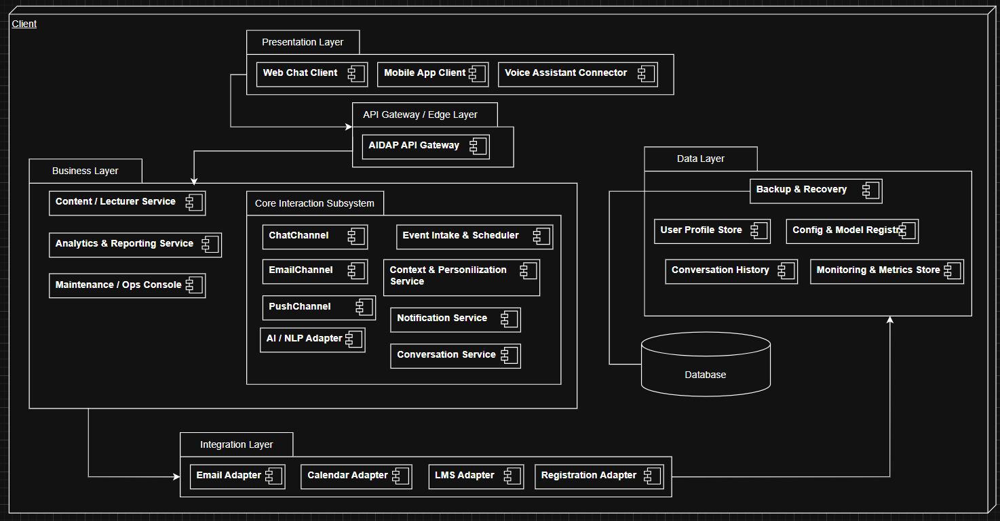
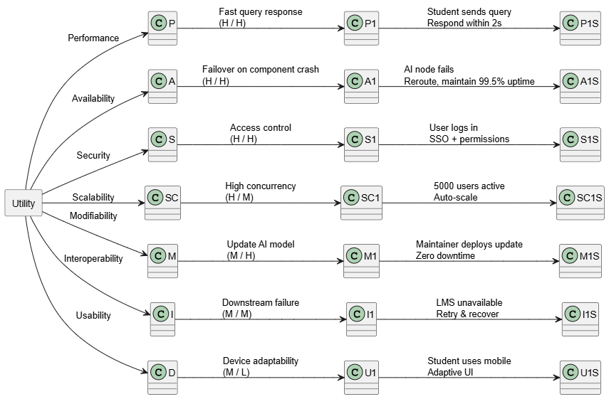

# ATAM Evaluation Report  
**AI-Powered Digital Assistant Platform (AIDAP)**

---

# 1. Introduction

The Architecture Tradeoff Analysis Method (ATAM) evaluates the architectural decisions made for the AI-Powered Digital Assistant Platform (AIDAP). ATAM identifies risks, non-risks, sensitivity points, and tradeoffs related to quality attributes such as performance, security, availability, scalability, and modifiability. This report applies ATAM to the AIDAP architecture resulting from Iteration 2 (ADD), using stakeholder requirements to generate scenarios, prioritize quality attributes, analyze architectural responses, and document risks.

---

# 2. Business Drivers

## 2.1 Project Goals
The system provides a conversational interface for students, faculty, and administrators to interact with institutional data such as course schedules, deadlines, announcements, and academic analytics. The assistant integrates with external university systems (LMS, registration, calendars, and mail) and uses AI to deliver contextual answers.

## 2.2 Primary Quality Drivers
- **Performance** – response time should be <2 seconds (RS10)  
- **Availability** – 99.5% uptime (RS11), auto-failover (RA6)  
- **Security & Privacy** – SSO authentication, access control, data policies (RS7, RL8, RA5)  
- **Scalability** – up to 5,000 concurrent users (RA7)  
- **Modifiability** – easy integration of new AI models/services (RM5, RM3)  
- **Interoperability** – integrations with LMS, Registration, Calendar, and Email (R3, RD2), and work on mobiles and the web (RS9)

---

# 3. Architectural Approaches

AIDAP uses a client-server architecture.

## Architecture Diagram

## 3.1 Subcomponents and Responsibilities

| Subcomponent                        | Description / Responsibilities                                                                                                                                         | Layer (logical)          | Related Use Cases |
|------------------------------------|----------------------------------------------------------------------------------------------------------------------------------------------------------------------------------------------------------------|--------------------------|-------------------|
| Conversation Service               | Main controller for UC-1. Receives `(userId, message)` from the API Gateway, retrieves user context, calls AI / NLP Adapter for intent and answer, queries Integration Layer adapters, and returns final answer. | Application Services     | UC-1              |
| Notification Service               | Main controller for UC-2. Consumes scheduled notification jobs, determines target users and channels, and dispatches notifications via NotificationChannel strategies.                                        | Application Services     | UC-2              |
| Event Intake & Scheduler           | Listens for events from Integration Layer (LMS/Registration/Calendar). Normalizes events, calculates when notifications should be sent, and queues jobs for Notification Service.                            | Application Services     | UC-2              |
| Context & Personalization Service  | Provides high-level APIs to load user profiles, enrolments, preferences, and history; records interactions/notifications; centralizes personalization rules and privacy enforcement.                         | App Services (with access to Data & Infrastructure) | UC-1, UC-2        |
| AI / NLP Adapter                   | Encapsulates calls to external AI/NLP providers. Offers `interpret(message, context)` and `generateAnswer(data, context)` and handles configuration (model versions, keys), timeouts, and errors.          | Application Services     | UC-1, UC-2 (optional for templated notifications) |
| NotificationChannel strategies     | Interface and concrete channel implementations (ChatChannel, PushChannel, EmailChannel). Used by Notification Service to send messages through different delivery channels.                                | Application Services     | UC-2              |

## 3.2 Subsystem Elements
| Element / Component                | Key Connectors / Interactions                                                                                           |
|-----------------------------------|-------------------------------------------------------------------------------------------------------------------------|
| Conversation Service              | Receives queries from API Gateway; calls Context & Personalization, AI / NLP Adapter, and LMS/Registration/Calendar Adapters. |
| Notification Service              | Receives jobs from Event Intake & Scheduler; calls Context & Personalization, NotificationChannel strategies, Email Adapter.   |
| Event Intake & Scheduler          | Receives events from LMS/Registration/Calendar Adapters; enqueues notification jobs for Notification Service.           |
| Context & Personalization Service | Communicates with User Profile Store and Conversation History Store; used by Conversation and Notification Services.    |
| AI / NLP Adapter                  | Called by Conversation Service (and optionally Notification Service) to interpret queries and generate text responses.  |
| NotificationChannel strategies    | Implement channel-specific sending (chat, push, email); used by Notification Service.                                   |

## 3.3 Architectural Tactics
- **Performance** – caching, asynchronous calls, load balancing  
- **Availability** – redundancy, health checks, failover  
- **Security** – OAuth SSO, RBAC, encryption  
- **Modifiability** – modular services, model adapter layer  
- **Interoperability** – REST/GraphQL APIs, retry logic  

---

# 4. Quality Attribute Scenarios

### Performance Scenario  
A student submits a query during normal load; the system must respond within **2 seconds** on average.

### Availability Scenario  
If an inference node fails, the system automatically reroutes traffic and maintains **99.5% uptime**.

### Security Scenario  
When the user logs in, the system authenticates via SSO and restricts access to their own data.

### Scalability Scenario  
At **5,000 concurrent users**, the system scales horizontally without degraded performance.

### Modifiability Scenario  
When maintainers deploy a new AI model version, the system updates with **zero downtime**.

### Interoperability Scenario  
If the LMS API is unavailable, the system retries gracefully and recovers without user disruption.

---

# 5. ATAM Utility Tree

## 5.1 Top-Level Categories
- Performance  
- Availability  
- Security  
- Scalability  
- Modifiability  
- Interoperability  
- Usability  

## 5.2 Utility Tree Diagram

## 5.3 Utility Tree Table

| Quality Attribute | Scenario Name | Scenario Description | Stimulus | Response | Priority (Business / Technical) |
|------------------|---------------|----------------------|----------|----------|--------------------------------|
| Performance | P1 | Fast query response | Student sends query | Respond within 2s | H / H |
| Availability | A1 | Failover on component crash | AI node fails | Reroute, maintain 99.5% uptime | H / H |
| Security | S1 | Access control | User logs in | SSO + permissions | H / H |
| Scalability | SC1 | High concurrency | 5000 users active | Auto-scale | H / M |
| Modifiability | M1 | Update AI model | Maintainer deploys update | Zero downtime | M / H |
| Interoperability | I1 | Downstream failure | LMS unavailable | Retry & recover | M / M |
| Usability | U1 | Device adaptability | Student uses mobile | Adaptive UI | M / L |

---

# 6. Scenario Prioritization

### High-Priority Scenarios  
1. Performance (P1)  
2. Availability (A1)  
3. Security (S1)  
4. Scalability (SC1)

### Medium Priority  
- Modifiability (M1)  
- Interoperability (I1)

### Low Priority  
- Usability (U1)

---

# 7. Attribute-Based Analysis  
## 7.1 Sensitivity Points

| Area | Sensitivity Reason |
|------|--------------------|
| AI Model Latency | Complex models increase inference time |
| API Gateway | Bottleneck affecting availability & scalability |
| Caching Layer | Affects performance and data freshness |
| SSO Workflow | Impacts security and response speed |
| Autoscaling Rules | Affect scalability and cloud cost |

## 7.2 Tradeoff Points

| Tradeoff | Explanation |
|----------|-------------|
| Performance vs. Accuracy | More accurate models may exceed response time limits |
| Caching vs. Freshness | Faster responses may return stale data |
| Scalability vs. Cost | Autoscaling increases resource usage |
| Security vs. Usability | Stricter SSO flows reduce convenience |

---

# 8. Risk Assessment Table

| ID | Risk Description | Impact | Probability | Category |
|----|------------------|--------|-------------|----------|
| R1 | AI inference latency may exceed 2s under load | High | Medium | Performance |
| R2 | Failover may not cover all services | High | Low | Availability |
| R3 | External system failures may cascade | Medium | Medium | Interoperability |
| R4 | Model updates may cause downtime | Medium | Medium | Modifiability |
| R5 | Weak authorization may expose data | High | Low | Security |
| R6 | Scaling to 5000 users may exceed budget | Medium | High | Scalability |
| R7 | API gateway may become single point of failure | High | Medium | Availability |

---

# 9. Non-Risks

| ID | Non-Risk Description |
|----|-----------------------|
| NR1 | Standard APIs ensure interoperability |
| NR2 | SSO + RBAC provide strong security |
| NR3 | Cloud-native deployment supports redundancy |
| NR4 | Logging/monitoring provide operational visibility |

---

# 10. Risk Themes

### 1. AI Inference Bottlenecks  
Latency is highly sensitive and directly impacts performance and scalability.

### 2. External System Reliability  
AIDAP depends heavily on LMS and registration systems.

### 3. Single Points of Failure  
The API gateway is a critical bottleneck and risk.

### 4. Deployment & Modifiability Challenges  
Model updates require reliable CI/CD and versioning.

---

# 11. Summary

The ATAM evaluation shows that AIDAP's architecture supports its performance, security, and scaling requirements. The utility tree and scenario priorities reflect clear stakeholder needs. Main risks involve AI latency, dependency on external systems, and CI/CD reliability. With strong mitigation—redundancy, optimizations, and robust deployment pipelines—AIDAP can meet institutional quality goals.
