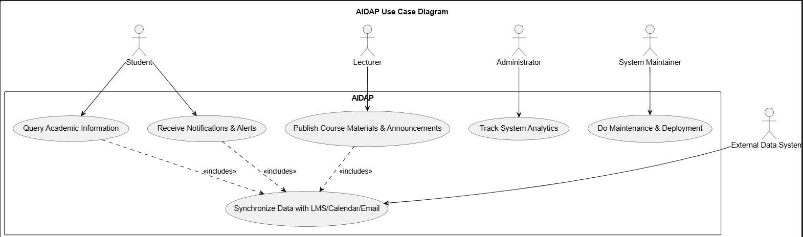

# Use Case Models

## Use Case Overview

The AIDAP system provides a conversational interface for students, faculty, and administrators to interact with
institutional data such as course schedules, deadlines, announcements, and academic analytics.

Each stakeholder performs different functions listed in the next section.

## Primary Actors

| Actor | Description |
| :--- | :--- |
| Student (S) | End users who query academic and campus information. |
|Lecturer (L) | Provide course-related content and respond to academic queries |
|Administrator (A) | Maintain institutional data, integrations, and policies. |
|System Maintainer (M) | Responsible for deployment, monitoring, and upgrades. |
| External Data Systems (D) | External systens such as LMS, Registration, Calendar, and Email servers. |

## Main Use Cases

### Use Case 1: Query Academic Information

| Field | Description |
| :--- | :--- |
| Actor | Student |
| Goal | Retrieve academic information such as exam dates, grades, or deadlines. |
| Preconditions | Student should be authenticated through institutional SSO. |
| Basic Sequence | 1. Student uses the chat or voice feature to ask a question.   2. AI model interprets the query.   3. System retrieves answer from LMS or database.   4. Response is shown in chat with accurate and contextual information. |
| Postconditions | Query and response logged for analytics and personalization. |
| Alternative Sequence | At step 3, if necessary information is not available, system provides fallback info or prompts for clarification. |
| Related Requirements | R1, R3, R5, R6, RS1, RS8, RS10 |

### Use Case 2: Receive Notifications and Alerts

| Field | Description |
| :--- | :--- |
| Actor | Student |
| Goal | Receive notifications for deadlines, schedule changes, and announcements. |
| Preconditions | Student has configured notifications. |
| Basic Sequence | 1. System triggered by new event or announcement.   2. Assistant sends a message.   3. Student acknowledges or dismisses the notification. |
| Postconditions | User receives notification and notification is logged |
| Related Requirements | R1, R3, RS2, RS6, RS9, RS10 |

### Use Case 3: Publish Course Materials and Announcements

| Field | Description |
| :--- | :--- |
| Actor | Lecturer |
| Goal | Upload/update course content and release announcements. |
| Preconditions | Lecturer is authenticated and has permissions. |
| Basic Sequence | 1. Lecturer issues a command.   2. System checks permissions and authorizes.   3. New data uploaded and synchronized with LMS.   4. Students receive a notification. |
| Postconditions | Course data in linked systems updated. |
| Related Requirements | R1, R3, RL1, RL2, RL8 |

### Use Case 4: Track System Analytics

| Field | Description |
| :--- | :--- |
| Actor | Administrator |
| Goal | Track metrics (usage, performance, and system health). |
| Preconditions | Administrator is authenticated and has permissions. |
| Basic Sequence | 1. Administrator requests analytics.   2. System checks permissions and authorizes.   3. System retrieves usuage data and performance logs. |
| Postconditions | Reports generated, displayed, and stored securely. |
| Related Requirements | RA4, RA6, RM2, RM4 |

### Use Case 5: Do Maintenance and Deployment

| Field | Description |
| :--- | :--- |
| Actor | System Maintainer |
| Goal | Push updates and monitor uptime. |
| Preconditions | Maintainer is authenticated and has permissions. |
| Basic Sequence | 1. Maintainer issues deployment.   2. System checks permissions and authorizes.   3. Deploys new version to cloud.   4. System monitors performance and logs for review. |
| Postconditions | Update deployed without error. |
| Alternative Sequence | If error occurs during deployment, roll back changes and notify maintainer of error. |
| Related Requirements | R7, RA6, RM1, RM2, RM6, RM7 |

## Main Use Cases (FCAPS Style)

| Use Case ID & Name | Description | Related Requirements |
| :--- | :--- | :--- |
| **UC-1: Query Academic Information** | Student asks questions about grades, deadlines, or exam dates using chat or voice. System interprets the query via AI, retrieves live data from LMS/Registration/Calendar [R1, R3, R5, R6], enforces SSO and per-user isolation [RS7, RS8], logs the interaction for personalization, and returns answers within ≤2s [RS10]. Fallback or clarification provided if data is missing [RS13]. | R1, R3, R5, R6, RS1, RS7, RS8, RS10, RS13 |
| **UC-2: Receive Notifications and Alerts** | Student receives notifications for deadlines, schedule changes, and announcements based on configured preferences [R1, R3]. Notifications are delivered via chat or voice, acknowledgment is recorded [RS2, RS6], and alerts are queued to meet performance targets [RS9, RS10]. | R1, R3, RS2, RS6, RS9, RS10 |
| **UC-3: Publish Course Materials and Announcements** | Lecturer issues commands to upload or update course content and release announcements [R1, R3, RL1, RL2]. System verifies authorization [RL8], synchronizes updates with LMS, and notifies students automatically. | R1, R3, RL1, RL2, RL8 |
| **UC-4: Track System Analytics** | Administrator requests dashboards to monitor usage, performance, and system health [RA4, RA6, RM2, RM4]. System retrieves logs and metrics, visualizes key indicators, and securely stores reports. | RA4, RA6, RM2, RM4 |
| **UC-5: Do Maintenance and Deployment** | System Maintainer triggers automated deployment pipelines to push updates [R7, RA6, RM1, RM2]. System authorizes actions, deploys new versions to the cloud, monitors uptime, latency, and errors, and logs metrics for review [RM6, RM7]. If deployment fails, rollback occurs and maintainer is notified. | R7, RA6, RM1, RM2, RM6, RM7 |

## Use Case Diagram
